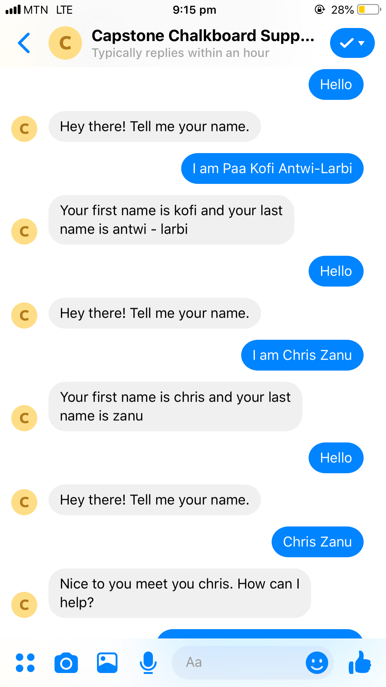
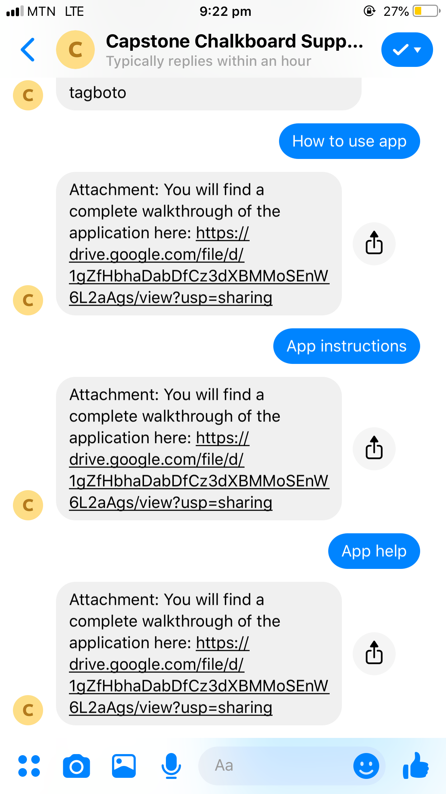

# Automated Chatbot for Chalkboard Education using Natural Language Processing by Yoofi Brown-Pobee

## Purpose of the Chatbot
I work for Chalkboard Education and we make learning materials accessiblle via SMS, USSD and the internet. With the internet we provide an online that allows schools to disseminate their digitised content to their students efficiently at low cost. Sometimes students have problems with their accounts (they have forgotten their login tokens or do not know how to navigate the platform) and personnel are not always available to assist. The Chatbot eliminates this problem by automating some repetitive functionality to reduce the amount of time personnel spend troubleshooting as well as enabling more students to be assisted during odd hours. 
The bot is built to run on Facebook Messenger and presently I am working on deploying it to a live server and configuring the web hooks. For now you can view, download and test the files in your own console. 

The bot is able to:
* Understand user input expressed in a variety of ways to determine the ultimate intent
* Collect and learn from user inputs to improve intent identification
* Resolve Login Issues
* Enrol students in courses
* Send walkthrough and other onboarding materials

Check out the paper I wrote on this year-long project [here](https://drive.google.com/file/d/1SzDJjEasXYUsCR5AcsCCwd9Q_mZgOUVq/view?usp=sharing)

Check out my presentation on my project [here](https://aucampus-my.sharepoint.com/:p:/g/personal/joseph_brown-pobee_alumni_ashesi_edu_gh/Eagz_EDlPwlHlhHfyH6uUvEBvzChr_FasMuS06L_YOXoBw?e=tSq565)

Check out a video demo that was part of my presentation (in case you have difficulty downloading the files to test) [here](https://aucampus-my.sharepoint.com/:v:/g/personal/akorsah_ashesi_edu_gh/EW8gFblP3a9Gq83WNxTVcKsBPy511SAGUheQXOmJbO6ZRQ?e=wJ4hSn)

### Screenshots of the Bot in Action






## How the Chatbot Works

Chatbot Architecture


### NLU Interpreter
This component is responsible for understanding user input. For a given input, it breaks it down by words to identify the intent of the user. It does this using pre-trained sentences for given intents and compares similarity. It also extracts entities from input. Entities are key objects that are useful when executing actions and generating responses. The interpreter is also responsible for slot filling. Slots represent information required for certain actions. For instance, if a user wants to enrol for a course, a slot to be filled is the user’s name and the course name. 

#### Training with the NLU Interpreter
##### Intent Classification
RASA can use different pipelines to process user messages. A pipeline defines different components which process a user message sequentially and ultimately lead to the classification of user messages into intents and the extraction of entities. The two most important pipelines RASA uses are tensorflow_embedding and spacy_sklearn. spacy_sklearn is more suitable for this project because it uses pre-trained word vectors which is very useful when training data is limited. Using this pipeline, RASA takes each piece of training data and its marked intent to create a training data object. This object has the text of the document, its intent and the entities marked as keys in the object. RASA uses an Sklearn Intent Classifier. The classifier uses spaCy, an open source library for natural language processing, to convert each training object into a list of tokens(words), creating a bag of words. This is referred to as tokenization. RASA then uses moves to featurize this bag of words by converting the tokens into word vectors. These are known as Word embeddings which can capture semantic and syntactic aspects of words. Machine Learning Algorithms understand numerical data which is why the words need to be converted to word vectors. The features are then labeled with the intents they describe in a numerical format. Hence instead of labels like [login, list_courses], numbers will be assigned to represent the labels.

The Sklearn Intent Classifier uses GridSearch with intent names as labels and features as those generated by the featurizer to generate a Machine Learning Model. The Machine Learning Model is a mathematical representation of a real word process; in this case, determining whether a given text belongs to a particular intent. GridSearch is a hyperparameter tuning algorithm that helps identify the optimal hyperparameter to use in a machine learning model. It works by building and evaluating a machine learning model for each combination of parameters specified. Hyperparameters are values that help a model produce the most accurate predictions but cannot be estimated from the data. Selecting hyperparameters can be likened to tuning a radio for the right frequency. Once this is done, it stores the model in a persisted file. The final output is an Interpreter object which can classify an intent based on the model. When a new input is provided, the Interpreter returns a numerical value based on the model trained which needs to be decoded to arrive at the actual intent tag. A set of confidence values are created for each prediction, and the highest confidence value is selected as the intent.

##### Entity Extraction
RASA uses Named Entity Recognition using Conditional Random Fields (NER_CRF) as the algorithm for entity extraction. Named Entity Recognition is used to identify and classify words in a document into defined categories/labels. Conditional Random Fields are used to predict the most likely sequence of labels based on a sequence of inputs. Here, again, as part of preprocessing, the text is tokenized but in this case stop, words are not removed as is the case in other NLP techniques. This is because, with NER_CRF, every feature depends on features preceding and succeeding it. The training data is converted with entities to a list of tuples with a start_index, end_index, and entity. So for instance, the marked training data “I am Dennis[first_name]” would have a tuple of [(5,10, ‘first_name’)] to denote where the entity starts and ends in that sample. The range (5, 10) is regarded as the offset of the entity. This helps tag tokens from the preprocessing step. BILOU (Begin, Inside, Last, Other, Unigram) tagging is a way of encoding information in a set of labels by recognizing the Beginning, Inside and the Last token of data relating to entities and differentiate them from Other tokens and unigram tokens. It is used for each token whereby if the token falls within the offset of the entity tag, an entity tag is attached to it; if the token does not, it is given a value of 0. We end up with each token and its assigned entity in each training example. After this is completed each token is again analyzed to determine further characteristics about the word for training. Characteristics like the previous word, whether the previous words is a title, whether the current word is a digit and whether it is at the end of a sentence are taken. This information together with the information from BILOU tagging is used to train and fit a CRF model for prediction. During prediction, the text entered by the user is broken into tokens and processed to arrive at the breakdown of its characteristics. This breakdown is then fed to the CRF model for classification. We obtain a list with the probability that a token has a BILOU tag. Tags with 0 are ignored. A new entry like ‘I am Jesse’ would result in a result in a result such as [{‘start’: 5, ‘end’:9, ‘value’:’Jesse,’ ‘entity’: ‘first_name’}].

### Dialog Manager
This component is responsible for keeping track of the conversation state at all times.  The Tracker stores and maintains the state of the dialogue with a single user. Events describe everything that occurs in a conversation and are stored in the tracker. The Tracker stores Events such as:
* The user saying something to the bot. 
* The bot saying something to the user 
* The user specifying the value for a slot 
* The bot restarting a conversation
* The conversation being paused and resumed
* An Action being executed or rejected
* The last action executing
* The number of state turns and intents made

The Tracker also stores current slot and entity values. It passes its state to the Policy object which decides what action to take at every step in the dialogue. The Policy predicts the next action the bot should take after being passed the tracker. It produces a list of probabilities/confidence scores for the next actions based on the state of the Tracker and selects the one with the highest probability. The Policy can decide by training on the Trackers it receives. The Tracker provides a bag of active features which consist of Events that have been recorded. Policy converts these features into vector representation with an array containing the target class labels encoded as one-hot vectors. It does this using multiple Featurizers. For instance, the BinarySingleStateFeaturizer creates a binary one-hot encoding with the vector indicating the presence of an intent, entity, previous action or slot. After featurizing, te Policy trains on the Tracker features and then predicts the action probabilities. Keras and Memoization Policies are some policies RASA uses. The former uses a neural network implemented in Keras to select the next action and the latter simply memorizes the conversations in the training data and predicts the next action based on this. If the Policy used returns low confidence in multiple stages, a two-stage Fallback Policy is used which asks the user to first affirm the intent. If is affirmed, the conversation continues with the affirmed intent and if not the user is asked to rephrase their message. If the rephrased message produces high confidence, the conversation continues; if not, the user is asked to affirm again. If the user affirms the second time the conversation continues, if not a fallback action is executed by the Action Manager.
The action to be taken next is passed to the action manager. Upon executing the action, the action manager sends the output of the action to the dialog manager who then generates a response to be sent back to the user.

### Action Manager
	This component is responsible for generating and executing the necessary code for successfully executing actions. It works with a database by generating and executing necessary sql queries to cull data. It also formats the data received from the database in a form suitable for the dialog manager. The Action Manager also interacts with the Twilio API to send text messages to a number provided by the Dialog Manager. Login URLs will be sent through this means. It also uses the Python SMTP Library to send an email to personnel at  Chalkboard in the event the chatbot receives queries it is unable to handle. The Manager stores all the tokens that are necessary to interact with these APIs. The Manager is also responsible for writing logs of conversations with users for storage.

## Setup and installation

If you haven’t installed Rasa NLU and Rasa Core yet, you can do it by navigating to the project directory and running:  
```
pip install -r requirements.txt
```

You also need to install a spaCy English language model. You can install it by running:

```
python -m spacy download en
```


### Files for Rasa NLU model

- **data/nlu_data.md** file contains training examples of intents: 
	- greet
	- goodbye
	- thanks
	- deny
	- joke
	- login
	
- **nlu_config.yml** file contains the configuration of the Rasa NLU pipeline:  
```yaml
language: "en"

pipeline: spacy_sklearn
```	

### Files for Rasa Core model

- **data/stories.md** file contains some training stories which represent the conversations between a user and the assistant. 
- **domain.yml** file describes the domain of the assistant which includes intents, entities, slots, templates and actions the assistant should be aware of.  
- **actions.py** file contains the code of a custom action which retrieves a Chuck Norris joke by making an external API call.
- **endpoints.yml** file contains the webhook configuration for custom action.  
- **policies.yml** file contains the configuration of the training policies for Rasa Core model.

## How to use this starter-pack?
- NOTE: If running on Windows, you will either have to [install make](http://gnuwin32.sourceforge.net/packages/make.htm) or copy the following commands from the [Makefile](https://github.com/RasaHQ/starter-pack-rasa-stack/blob/master/Makefile)
1. You can train the Rasa NLU model by running:  
```make train-nlu```  
This will train the Rasa NLU model and store it inside the `/models/current/nlu` folder of your project directory.

2. Train the Rasa Core model by running:  
```make train-core```  
This will train the Rasa Core model and store it inside the `/models/current/dialogue` folder of your project directory.

3. In a new terminal start the server for the custom action by running:  
```make action-server```  
This will start the server for emulating the custom action.

4. Test the assistant by running:  
```make cmdline```  
This will load the assistant in your terminal for you to chat.

